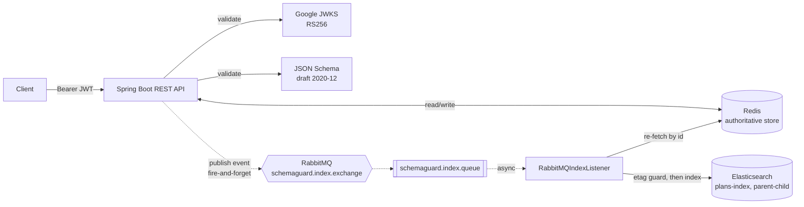

# SchemaGuard

[](https://github.com/PragatiAN1109/SchemaGuard/actions/workflows/ci.yml)
[](LICENSE)
[](pom.xml)
[](pom.xml)

**Stack:** Java 17 · Spring Boot · Redis · RabbitMQ · Elasticsearch · OAuth2/JWT · Docker Compose

SchemaGuard is a Spring Boot backend that validates and manages nested healthcare-plan documents while maintaining an authoritative Redis-backed store and a searchable Elasticsearch index. Writes are validated against a JSON Schema and protected by ETag-based optimistic concurrency; Elasticsearch is updated asynchronously via RabbitMQ, and an event-version check prevents a delayed queued event from overwriting state that has already moved on.

## Problem being solved

Nested documents (a healthcare plan with linked services and cost shares) need to be:
1. Structurally validated before they're accepted,
2. Safe to update concurrently without silently clobbering someone else's write, and
3. Searchable by fields on both the top-level plan and its nested child records — without making every read pay the cost of a full-document Elasticsearch reindex on every write.

SchemaGuard separates these concerns: Redis is the single authoritative store and the only thing the API writes to synchronously; Elasticsearch is a derived, searchable index kept in sync asynchronously. Elasticsearch is treated as a derived index rather than the authoritative store — but the current implementation does not provide a full Redis-to-Elasticsearch rebuild operation. RabbitMQ is a work queue here, not a retained event log: once a message is acknowledged it's gone. Restoring a lost or corrupted index would require re-emitting records some other way or adding a reconciliation process (see [Limitations](#limitations-and-future-improvements)).

## Key capabilities

- **JSON Schema validation** (draft 2020-12) on `POST`, `PUT`, and `PATCH`, using the exact schema also exposed at `GET /api/v1/schema/plan`.
- **Full CRUD** — `POST`, `GET` (with `If-None-Match` support), `PUT` (full replace), `PATCH` (JSON Merge Patch, RFC 7396), `DELETE` — all against Redis.
- **ETag-based optimistic concurrency** — SHA-256 ETags, optional `If-Match` precondition on writes, `304`/`412` handled per HTTP semantics.
- **Event-driven Elasticsearch indexing** — every successful write publishes an event to RabbitMQ; a single consumer re-indexes Elasticsearch by re-reading the current Redis state, never the event payload.
- **Stale-event rejection** — for UPSERT/PATCH, the consumer compares the event's ETag to the current Redis ETag and skips indexing if a newer write has already superseded it; for DELETE, it checks whether the id still exists in Redis and skips if it does, so a delayed delete can't remove a plan that was recreated under the same `objectId`.
- **Elasticsearch parent-child search** — `has_child`/`has_parent`/`parent_id` queries exposed as REST endpoints, with cascaded deletion of children before parent.
- **Google OAuth2 (RS256) JWT security** on plan and search endpoints; schema and health endpoints are public.
- **Standardized error contract** — every error response has the same JSON shape.
- **One-command local stack** via Docker Compose (Redis, RabbitMQ, Elasticsearch, the app).

## Architecture



Solid arrows are synchronous (part of the HTTP request); dashed arrows are asynchronous and happen after the response has already been returned. Full component breakdown and the parent-child indexing model: [docs/architecture.md](docs/architecture.md).

## Request and event flow

1. Client sends a request with a Bearer token.
2. Spring Security validates the JWT against Google's JWKS.
3. For writes, the body is validated against the plan JSON Schema.
4. ETag preconditions (`If-Match`/`If-None-Match`) are checked against the current Redis state.
5. Redis is read or written. The HTTP response is returned here — indexing has not happened yet.
6. On a successful write, an `IndexEvent` (operation, documentId, new etag, timestamp) is published to RabbitMQ — fire-and-forget; the response does not wait on this.
7. `RabbitMQIndexListener` consumes the event, re-fetches the current document from Redis, compares the event's etag to the current one, and — if they still match — indexes the parent and its children into Elasticsearch. If a newer write has already superseded the event, it's skipped.

Full sequence and the reasoning behind re-fetching from Redis instead of trusting the event payload: [docs/consistency-model.md](docs/consistency-model.md).

## Key engineering decisions

| Decision | Why |
|----------|-----|
| Redis is the single authoritative store; Elasticsearch is derived | Losing an Elasticsearch document risks staleness, not data loss — Redis still holds the authoritative copy. There is no automatic rebuild yet, though: a document stays missing from search until its own next write in Redis triggers a fresh index event. |
| The consumer re-fetches from Redis rather than indexing the event payload | Makes indexing idempotent under redelivery and immune to processing events out of order — the last-processed event always ends up reflecting the current Redis state, not whatever data it happened to carry. |
| ETag comparison at consume-time, not at publish-time | The event is published synchronously with the write, but may be processed much later — checking staleness right before indexing is what actually prevents an old snapshot from overwriting a newer one. |
| Fire-and-forget publish (no outbox, no publisher confirms) | Kept the write path simple for this project's scope, at the explicit cost of a dual-write gap — documented in [Consistency and failure model](#consistency-and-failure-model) rather than hidden. |
| Elasticsearch writes/deletes are idempotent upserts and no-op-on-absent | Lets a redelivered message be safely reprocessed without special-casing "already applied." |

## Quick start

```bash
export GOOGLE_CLIENT_ID=<your-client-id>.apps.googleusercontent.com
docker compose up --build
```

This starts **four services**: Redis (`6379`), RabbitMQ (`5672`, management UI on `15672`), Elasticsearch (`9200`), and the app (`8080`). The app waits for all three infrastructure services to report healthy before starting.

You'll need a Google ID token to call protected endpoints — see [Getting a Google ID token](docs/local-development.md#getting-a-google-id-token). Full environment variable reference and running without Docker: [docs/local-development.md](docs/local-development.md).

## Representative API examples

```bash
TOKEN="<your Google ID token>"

# Create a plan (schema-validated)
curl -X POST http://localhost:8080/api/v1/plan \
  -H "Content-Type: application/json" \
  -H "Authorization: Bearer $TOKEN" \
  -d @samples/plan.json

# Conditional GET
curl -si http://localhost:8080/api/v1/plan/12xvxc345ssdsds-508 \
  -H "Authorization: Bearer $TOKEN"
# copy the ETag header, then:
curl -si http://localhost:8080/api/v1/plan/12xvxc345ssdsds-508 \
  -H "Authorization: Bearer $TOKEN" \
  -H 'If-None-Match: "<etag-from-above>"'
# → 304 Not Modified

# JSON Merge Patch (RFC 7396) with a concurrency guard
curl -X PATCH http://localhost:8080/api/v1/plan/12xvxc345ssdsds-508 \
  -H "Content-Type: application/merge-patch+json" \
  -H "Authorization: Bearer $TOKEN" \
  -H 'If-Match: "<current-etag>"' \
  -d '{"planType": "outOfNetwork"}'

# Search parents by a child field
curl -s "http://localhost:8080/api/v1/search?childField=objectType&childValue=planservice" \
  -H "Authorization: Bearer $TOKEN"
```

Every endpoint, parameter, and status code: [docs/api-reference.md](docs/api-reference.md). Full create → index → patch → cascade-delete → stale-event walkthrough: [docs/demo-runbook.md](docs/demo-runbook.md).

## Testing

```bash
./mvnw test
```

Runs under the `test` Spring profile — `InMemoryKeyValueStore` in place of Redis, `NoOpIndexEventPublisher` in place of RabbitMQ (RabbitMQ autoconfiguration is excluded), and `@WithMockUser` in place of real Google tokens. No Docker services are required.

Current coverage:
- **Controller/integration** (`PlanCrudIntegrationTest`, MockMvc): create → 201, get → 200/304, delete → 204, 404 on missing plan, 409 on duplicate create, precondition rejection on stale `If-Match`.
- **JSON Merge Patch unit tests** (`MergePatchUnitTest`): scalar overwrite, null-removes-field, new-field addition, nested-object merge, non-object patch replaces target, empty patch is a no-op.
- **Schema validation** (`SchemaValidatorTest`): valid payload passes, missing required field fails with reported errors.
- **KV store** (`InMemoryKeyValueStoreTest`): create/get/exists/delete lifecycle, including duplicate-create rejection.
- **Async consumer** (`RabbitMQIndexListenerTest`): a stale UPSERT/PATCH event (older etag than the current Redis state) is skipped and never reaches the index service; a fresh event indexes the parent and every child; a `DELETE` removes children before the parent once Redis no longer has the document; a delayed `DELETE` for an id that was recreated in Redis is skipped rather than deleting the recreated plan's index entries.

Run `./mvnw --batch-mode clean verify` to also produce a packaged jar (same as CI).

## Consistency and failure model

The consumer prevents an older queued UPSERT/PATCH event from overwriting a newer Redis-backed version, and prevents a delayed DELETE event from removing a plan that was recreated under the same `objectId` — both verified by `RabbitMQIndexListenerTest`. Elasticsearch remains eventually consistent with Redis **while events are successfully published and processed**. That qualifier matters: publishing is fire-and-forget with no outbox and no publisher confirms, so if RabbitMQ is unreachable at write time, the event is dropped and Elasticsearch is not corrected until the next successful write to that document. The consumer has no configured retry/backoff or dead-letter queue — a permanently-failing message is nacked, requeued, and redelivered immediately with no backoff, producing a tight loop that repeatedly consumes CPU, error logs, and Elasticsearch requests until the message is purged from the queue or the consumer is stopped. Delivery is at-least-once, not exactly-once; indexing operations are idempotent upserts, so redelivery is safe but not deduplicated. There is also no full Redis-to-Elasticsearch rebuild path — RabbitMQ is a work queue here, not a retained event log, so a lost or corrupted index does not repair itself.

Full breakdown of what happens when Redis, RabbitMQ, or Elasticsearch is unavailable: [docs/failure-handling.md](docs/failure-handling.md). ETag mechanics and the stale-event sequence diagram: [docs/consistency-model.md](docs/consistency-model.md).

## Project structure

```text
SchemaGuard/
├── compose.yaml                    ← Redis + RabbitMQ + Elasticsearch + app
├── Dockerfile
├── src/main/java/com/schemaguard/
│   ├── config/                     ← Rabbit/Redis/Elasticsearch/Security wiring
│   ├── controller/                 ← Plan, Schema, Search, IndexAdmin REST endpoints
│   ├── elastic/                    ← IndexService, routing, parent-child search
│   ├── queue/                      ← IndexEvent, publisher, RabbitMQIndexListener
│   ├── store/                      ← KeyValueStore (Redis / in-memory)
│   ├── security/                   ← JWT claims logging, security error contract
│   ├── validation/                 ← JSON Schema validator
│   └── exception/                  ← Global exception → ApiError mapping
├── src/main/resources/
│   ├── schemas/plan-schema.json    ← the JSON Schema served and enforced
│   ├── application.properties
│   └── application-redis.properties
├── src/test/java/com/schemaguard/  ← see Testing above
├── samples/                        ← example valid/invalid plan payloads
└── docs/                           ← architecture, API reference, demo, consistency/failure model
```

## Limitations and future improvements

**Current limitations:**
- Redis is the sole authoritative store — there is no replication or backup story documented or configured here.
- The Redis write and the RabbitMQ publish are two separate, non-transactional steps; a crash between them loses the index update for that write.
- No RabbitMQ publisher confirms, consumer retry/backoff, or dead-letter queue are configured — a permanently-failing message redelivers in a tight, immediate loop (see [docs/failure-handling.md](docs/failure-handling.md)).
- No full Redis-to-Elasticsearch rebuild/reindex operation exists — RabbitMQ is used as a work queue, not a retained event log, so a lost or corrupted Elasticsearch index does not repair itself; only documents that get written again in Redis re-index automatically.
- Elasticsearch runs as a single node with security disabled — a local/demo configuration, not a production one.
- Authentication depends on a Google OAuth2 Client ID being configured externally; there is no offline/local auth mode.
- Backward/forward JSON Schema version compatibility is not implemented — schema changes are not checked against previously stored documents.
- The Docker Compose setup and demo tooling are built for local development and demonstration, not production deployment.

**Possible future improvements:**
- Transactional outbox pattern for the Redis-write-then-publish step.
- RabbitMQ publisher confirms and a bounded consumer retry policy with a dead-letter queue.
- A Redis-to-Elasticsearch rebuild/reindex operation (e.g. an admin endpoint that iterates `KeyValueStore.keys()` and re-indexes each document) for recovering from index loss without waiting on individual document writes.
- Schema-version compatibility analysis for evolving the plan schema safely.
- Testcontainers-based integration tests against real Redis/RabbitMQ/Elasticsearch.
- Observability via Micrometer/OpenTelemetry.
- Kubernetes manifests or another production deployment path.
- Automated load and failure-injection testing.

## Additional documentation

- [Architecture](docs/architecture.md) — components, diagrams, parent-child indexing
- [API Reference](docs/api-reference.md) — every endpoint, parameter, and error case
- [Consistency Model](docs/consistency-model.md) — ETag mechanics and stale-event detection
- [Failure Handling](docs/failure-handling.md) — what happens when Redis/RabbitMQ/Elasticsearch are down
- [Demo Runbook](docs/demo-runbook.md) — full end-to-end walkthrough
- [Local Development](docs/local-development.md) — environment variables, running without Docker, getting a token

## License

[MIT](LICENSE)
