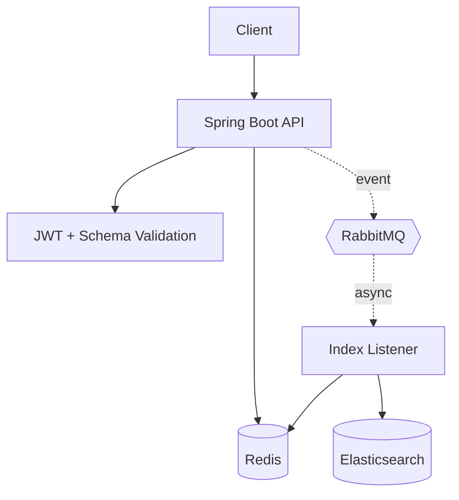

# SchemaGuard

[](https://github.com/PragatiAN1109/SchemaGuard/actions/workflows/ci.yml)
[](pom.xml)
[](pom.xml)
[](LICENSE)

**Stack:** Java 17 · Spring Boot · Redis · RabbitMQ · Elasticsearch · OAuth2/JWT · Docker Compose

SchemaGuard validates and manages nested healthcare-plan documents on top of Redis (the authoritative store) and Elasticsearch (a derived, asynchronously updated search index), using ETag-based optimistic concurrency and RabbitMQ event-driven indexing to keep the two in sync without ever letting a delayed event overwrite or incorrectly delete newer data.

## Table of Contents

- [Overview](#overview)
- [Problem](#problem)
- [Key Capabilities](#key-capabilities)
- [Architecture](#architecture)
- [Request and Event Flow](#request-and-event-flow)
- [Consistency Model](#consistency-model)
- [Failure Handling](#failure-handling)
- [API Reference](#api-reference)
- [Quick Start](#quick-start)
- [Configuration](#configuration)
- [Demo Walkthrough](#demo-walkthrough)
- [Testing](#testing)
- [Project Structure](#project-structure)
- [Limitations](#limitations)
- [Future Improvements](#future-improvements)
- [License](#license)

## Overview

SchemaGuard is a Spring Boot backend for storing and validating nested healthcare-plan documents. Redis is the authoritative store for every write. Elasticsearch is a derived, searchable, parent-child index kept eventually consistent through an asynchronous RabbitMQ pipeline. ETag-based optimistic concurrency guards concurrent writes, and the async consumer re-validates against the current Redis state before touching the index — so a delayed event can neither overwrite newer data nor delete a document that was recreated after the delete was published.

## Problem

Nested documents (a plan with linked services and cost shares) need to be:
1. Structurally validated before being accepted,
2. Safe to update concurrently without one write silently clobbering another, and
3. Searchable by fields on both the parent plan and its nested child records — without every read paying the cost of a full reindex on every write.

SchemaGuard's answer is separation of concerns: Redis is the only thing the API writes to synchronously; Elasticsearch is a derived index updated afterward, by a single consumer, over RabbitMQ. That decouples search from write latency, at the cost of a short, unbounded staleness window between a write and its index update — see [Consistency Model](#consistency-model) and [Failure Handling](#failure-handling) for exactly what that costs.

## Key Capabilities

- **JSON Schema validation** (draft 2020-12) on `POST`, `PUT`, and `PATCH`, using the exact schema also exposed at `GET /api/v1/schema/plan`.
- **Full CRUD** — `POST`, `GET` (with `If-None-Match` support), `PUT` (full replace), `PATCH` (JSON Merge Patch, RFC 7396), `DELETE` — all against Redis.
- **ETag-based optimistic concurrency** — SHA-256 ETags, optional `If-Match` precondition on writes, `304`/`412` handled per HTTP semantics.
- **Event-driven Elasticsearch indexing** — every successful write publishes an event to RabbitMQ; a single consumer re-indexes Elasticsearch by re-reading the current Redis state, never the event payload.
- **Stale-event rejection** — for UPSERT/PATCH, the consumer compares the event's ETag to the current Redis ETag; for DELETE, it checks whether the id still exists in Redis, so a delayed delete can't remove a plan that was recreated under the same `objectId`.
- **Elasticsearch parent-child search** — `has_child`/`has_parent`/`parent_id` queries exposed as REST endpoints, with cascaded deletion of children before parent.
- **Google OAuth2 (RS256) JWT security** on plan and search endpoints; schema and index-health endpoints are public.
- **Standardized error contract** — every error response has the same JSON shape.
- **One-command local stack** via Docker Compose (Redis, RabbitMQ, Elasticsearch, the app).

## Architecture



- **Solid arrows** are synchronous — part of the HTTP request/response.
- **Dashed arrows** are asynchronous — they happen after the response has already been returned. The publish call itself is a synchronous, fire-and-forget method call; it's drawn dashed because it's the entry point into the async indexing path.
- Redis is the authoritative application store in the current implementation. The API never writes to Elasticsearch directly.
- Elasticsearch is a derived, eventually consistent search index. The listener re-fetches current state from Redis before indexing — it never trusts the event payload's document content.
- JWT validation and JSON Schema validation both happen before a write is accepted.

| Component | Responsibility |
|-----------|-----------------|
| Spring Boot API | Validation, CRUD, ETag preconditions, event publication |
| Redis | Authoritative application store |
| RabbitMQ | Asynchronous index-event delivery |
| Index listener | Stale-event checks and Elasticsearch updates |
| Elasticsearch | Parent-child search index |
| Google OAuth2 / JWT | Authentication for protected endpoints |
| JSON Schema | Request-body validation |

### Infrastructure names

| Name | Value |
|------|-------|
| Exchange | `schemaguard.index.exchange` (topic, durable) |
| Queue | `schemaguard.index.queue` (durable) |
| Routing key | `index.event` |
| Elasticsearch index | `plans-index` |
| Join field | `my_join_field` — parent value `"plan"`, child value `{"name":"child","parent":"<parentId>"}` |
| Redis key prefix | `plan:<objectId>` |

### Parent-child indexing

`PlanDocumentSplitter` extracts each entry of a plan's `linkedPlanServices` array as a child document; everything else (including `planCostShares`) stays embedded in the parent and is searchable only through Elasticsearch's dynamic field mapping.

| Document | Join value | Routing |
|----------|------------|---------|
| Parent (`plan`) | `"plan"` (plain string) | its own `objectId` (ES default) |
| Child (`linkedPlanServices[i]`) | `{"name":"child","parent":"<parentId>"}` | `<parentId>` (set explicitly) |

Routing must match between parent and child so both land on the same shard — required for `has_child`/`has_parent`/`parent_id` queries to work without scattering to every shard.

### Synchronous vs. asynchronous, at a glance

| Operation | Synchronous | Asynchronous |
|-----------|:-----------:|:-------------:|
| Schema validation | ✅ | |
| ETag precondition check | ✅ | |
| Redis read/write | ✅ | |
| RabbitMQ publish (fire-and-forget call) | ✅ | |
| Elasticsearch indexing/deletion | | ✅ |

[Back to top](#schemaguard)

## Request and Event Flow

1. Client sends a request with a Bearer token.
2. Spring Security validates the JWT against Google's JWKS.
3. For writes, the body is validated against the plan JSON Schema.
4. ETag preconditions (`If-Match`/`If-None-Match`) are checked against the current Redis state.
5. Redis is read or written. The HTTP response is returned here — indexing has not happened yet.
6. On a successful write, an `IndexEvent` (operation, documentId, new etag, timestamp) is published to RabbitMQ — fire-and-forget; the response does not wait on this.
7. `RabbitMQIndexListener` consumes the event, re-fetches the current document from Redis, and applies the stale-event guard described below before indexing into Elasticsearch.

[Back to top](#schemaguard)

## Consistency Model

- **ETag calculation** — `EtagUtil.sha256Etag(json)` computes a SHA-256 hex digest of the raw plan JSON. Stored unquoted in `StoredDocument.etag`, alongside the document in Redis (`plan:<objectId>` → `{objectId, json, etag, lastModified}`) and as an `_etag` field in Elasticsearch.
- **`If-Match` (`PUT`/`PATCH`/`DELETE`)** — optional. If present, `PlanController` compares it (quotes stripped) to the current Redis ETag; a mismatch is `412 Precondition Failed`. A request with no `If-Match` is not rejected.
- **`If-None-Match` (`GET`)** — if it matches the current ETag, the API returns `304 Not Modified` with no body.
- **Stale UPSERT/PATCH guard** — every write publishes an event carrying the *new* ETag. `RabbitMQIndexListener` never trusts the event's own data; it re-fetches from Redis and compares `event.etag()` to the freshly-read ETag. A mismatch means a newer write has already superseded the event, so it's skipped (acknowledged, not an error).
- **Stale DELETE guard** — a `DELETE` event carries the ETag captured *before* deletion, which can't be compared against a "current" ETag once Redis no longer has the row. Instead, the listener checks `KeyValueStore.exists(documentId)` right before deleting from Elasticsearch. If Redis now has a document for that id, a plan was created (or recreated) under the same `objectId` after this `DELETE` was published — the event is stale and is skipped. If no such document exists, the delete proceeds: children first, then the parent. Verified by `RabbitMQIndexListenerTest#staleDeleteAfterRecreationDoesNotDeleteNewDocument`.
- **Delivery model** — at-least-once, not exactly-once. RabbitMQ's default requeue-on-failure behavior can redeliver a message; Elasticsearch index/delete operations are idempotent upserts, so redelivery is safe but not deduplicated.
- **What isn't guaranteed** — every write reaching Elasticsearch is not guaranteed (see [Failure Handling](#failure-handling) for the publish-failure case), and Elasticsearch does not repair itself if its index is lost (see [Limitations](#limitations)).

<details>
<summary>Detailed sequence diagrams (UPSERT/PATCH staleness, DELETE staleness)</summary>

**Stale UPSERT/PATCH — a slow event arrives after a newer write:**
```
Client                  API (Redis)                RabbitMQIndexListener        Elasticsearch
  │                          │                           │                    │
  ├─ PATCH v1 ──────────────►│ If-Match: etag_v0         │                    │
  │                          │ precondition passes        │                    │
  │                          │ Redis → etag_v1            │                    │
  │                          │ publish event(etag=v1) ───►│                    │
  │◄─ 200 etag_v1 ───────────│                           │                    │
  │                          │                           │                    │
  ├─ PATCH v2 ──────────────►│ If-Match: etag_v1         │                    │
  │                          │ precondition passes        │                    │
  │                          │ Redis → etag_v2            │                    │
  │                          │ publish event(etag=v2) ───►│                    │
  │◄─ 200 etag_v2 ───────────│                           │                    │
  │                          │                           │                    │
  │                          │          event(etag=v1) ──►│                    │
  │                          │          re-fetch → etag_v2│                    │
  │                          │          v1 ≠ v2 → skip   │                    │
  │                          │                           │                    │
  │                          │          event(etag=v2) ──►│                    │
  │                          │          re-fetch → etag_v2│                    │
  │                          │          v2 = v2 → index ─►│── index v2 ───────►│
```

**Stale DELETE — a delayed delete arrives after the same `objectId` is recreated:**
```
Client                  API (Redis)                RabbitMQIndexListener        Elasticsearch
  │                          │                           │                    │
  ├─ DELETE plan A ─────────►│ Redis: delete(A)          │                    │
  │                          │ publish DELETE(A) ───╮    │                    │
  │◄─ 204 ───────────────────│                       │    │                    │
  │                          │      (event delayed — poison message, outage) │
  ├─ POST plan A (new) ─────►│ Redis: create(A)          │                    │
  │◄─ 201 ───────────────────│ publish UPSERT(A) ───────►│                    │
  │                          │                           │ exists(A)? yes ───►│ index new A
  │                          │           DELETE(A) ──────╯                    │
  │                          │           exists(A)? yes → SKIP (stale)        │
```

Without the `exists()` check, that delayed `DELETE` would run `deleteChildren`/`deleteParent` on the id right after the new plan was indexed — silently erasing a document Redis still holds and considers current.

</details>

[Back to top](#schemaguard)

## Failure Handling

| Failure | Current behavior | Limitation |
|---------|-------------------|------------|
| Redis unavailable | `RedisKeyValueStore` calls fail and propagate as `500` via `GlobalExceptionHandler` | No fallback store, no local buffering |
| RabbitMQ unavailable when publishing | `RabbitMQEventPublisher.publish()` catches the exception, logs a warning, and drops the event | No retry, no local queue, no outbox — the Redis write already committed, so this is a dual-write gap until the next successful write to that document |
| Publisher confirms | Not enabled | A successful `convertAndSend()` only means the message reached the client library, not that the broker persisted it |
| Consumer throws while processing | Nacked and requeued (Spring AMQP default listener behavior) | No bounded retry count, no backoff — all retrying happens via broker redelivery |
| Permanently failing ("poison") message | Nacked, requeued, and redelivered immediately, forever | Produces a tight loop that repeatedly consumes CPU, error logs, and Elasticsearch requests until the message is manually purged or the consumer is stopped — no dead-letter queue exists to catch it |
| Elasticsearch unreachable during indexing | `ElasticsearchIndexService` catches the exception per operation, logs a warning, moves on | The event is still acknowledged even though the index write failed — no re-queue of failed index writes |
| Elasticsearch unreachable during search | Exception propagates; `SearchController` returns `500` | — |
| Elasticsearch index lost or corrupted | Does not recover on its own — no startup reconciliation, no scheduled re-sync, no rebuild endpoint | Only documents written again in Redis (`PUT`/`PATCH`) re-index automatically; the rest stays missing from search indefinitely |
| Application restart | `RabbitMQIndexListener` resubscribes to the durable queue; any redelivered messages are safe to reprocess | Idempotent operations and the stale-event guards make redelivery safe, but there's no explicit reconciliation on startup |

Not implemented anywhere in this path: a transactional outbox, RabbitMQ publisher confirms, bounded consumer retry/backoff, and a dead-letter queue. RabbitMQ here is a work queue, not a retained event log — once a message is acknowledged, it's gone and cannot be replayed.

[Back to top](#schemaguard)

## API Reference

Base URL: `http://localhost:8080`

| Method | Endpoint | Purpose | Authentication |
|--------|----------|---------|-----------------|
| `POST` | `/api/v1/plan` | Create a plan | Bearer token |
| `GET` | `/api/v1/plan` | List all stored plans (demo/debug) | Bearer token |
| `GET` | `/api/v1/plan/{objectId}` | Fetch a plan; supports `If-None-Match` | Bearer token |
| `PUT` | `/api/v1/plan/{objectId}` | Full replace; supports `If-Match` | Bearer token |
| `PATCH` | `/api/v1/plan/{objectId}` | JSON Merge Patch (RFC 7396); supports `If-Match` | Bearer token |
| `DELETE` | `/api/v1/plan/{objectId}` | Delete; supports `If-Match` | Bearer token |
| `GET` | `/api/v1/schema/plan` | The JSON Schema used to validate plans | Public |
| `GET` | `/api/v1/index/health` | Elasticsearch cluster/index reachability | Public |
| `GET` | `/api/v1/search/all` | `match_all` — every indexed document + total count | Bearer token |
| `GET` | `/api/v1/search` | `has_child` search, optional `childField`/`childValue`/`childOp`/`q` | Bearer token |
| `GET` | `/api/v1/search/parent/{parentId}/children` | `has_parent` — all children for a parent | Bearer token |

<details>
<summary>Full endpoint detail, error contract, and Elasticsearch mapping</summary>

### Authentication

Google OAuth2 RS256 Bearer tokens are validated against `https://www.googleapis.com/oauth2/v3/certs` (issuer `https://accounts.google.com`, audience = `GOOGLE_CLIENT_ID`). Missing/invalid tokens return `401`; valid-but-unauthorized requests return `403` — both in the error contract below. See [Quick Start](#quick-start) for getting a token.

### Error contract

Every error response (validation, not-found, conflict, precondition, auth, or unexpected) has this shape:

```json
{
  "timestamp": "2026-02-28T10:15:30Z",
  "status": 400,
  "error": "Bad Request",
  "message": "...",
  "path": "/api/v1/plan"
}
```

| Status | Cause |
|--------|-------|
| 400 | JSON Schema validation failure, malformed JSON body, invalid `childOp` |
| 401 | Missing or invalid Bearer token |
| 403 | Authenticated but not authorized |
| 404 | Plan not found |
| 409 | `objectId` already exists (`POST`) |
| 412 | `If-Match` does not match the current ETag |
| 500 | Unhandled server error, or (search endpoints) Elasticsearch unavailable |

### Plan endpoints (`/api/v1/plan`)

- **`POST /api/v1/plan`** — body validated against the JSON Schema. `201` with `ETag`/`Location` headers, `409` if `objectId` exists. Publishes an `UPSERT` event on success only.
- **`GET /api/v1/plan`** — lists all stored plans (`objectId`, `etag`, `lastModified`) from Redis. Not paginated.
- **`GET /api/v1/plan/{objectId}`** — returns the plan with an `ETag` header; `If-None-Match` → `304`; `404` if missing.
- **`PUT /api/v1/plan/{objectId}`** — full replace; optional `If-Match` → `412` on mismatch; re-validated against the schema; publishes `UPSERT` with the new ETag on `200`.
- **`PATCH /api/v1/plan/{objectId}`** — `Content-Type: application/merge-patch+json`. Applies [RFC 7396](https://www.rfc-editor.org/rfc/rfc7396): object fields merge recursively, `null` removes a field, a non-object patch replaces the target outright. Optional `If-Match`; merged document re-validated against the schema; publishes `PATCH` with the new ETag on `200`.
- **`DELETE /api/v1/plan/{objectId}`** — optional `If-Match`; deletes from Redis, then publishes a `DELETE` event carrying the ETag captured immediately before deletion; returns `204`.

### Schema and index-health endpoints

- **`GET /api/v1/schema/plan`** — the exact JSON Schema (draft 2020-12) used to validate plan payloads, loaded once from the classpath. Public.
- **`GET /api/v1/index/health`** — pings the Elasticsearch cluster and checks whether `plans-index` exists; returns `{"cluster": "...", "index": "...", "indexName": "plans-index"}`. Public, read-only, no plan data exposed.

### Search endpoints (`/api/v1/search`)

All search endpoints query Elasticsearch, which lags Redis by however long `RabbitMQIndexListener` takes to process the corresponding event. The implementation does not define or measure a maximum indexing delay.

- **`GET /api/v1/search/all`** — `match_all`, returns every indexed document (parents and children) with a total count. Useful for confirming index state directly.
- **`GET /api/v1/search`** — `has_child` query. Params (all optional): `q` (free-text on the parent), `childField`/`childValue` (must be provided together or both omitted, else `400`), `childOp` (`gt`/`gte`/`lt`/`lte` — switches to a range query, e.g. `childField=copay&childOp=gt&childValue=100`).
- **`GET /api/v1/search/parent/{parentId}/children`** — `has_parent` query, all children for a parent. Returns `count: 0` with an empty array if none exist (not a `404`).

```bash
curl -s "http://localhost:8080/api/v1/search?childField=copay&childOp=gt&childValue=100" \
  -H "Authorization: Bearer $TOKEN"
```

### Elasticsearch mapping

```json
{
  "mappings": {
    "dynamic": true,
    "properties": {
      "objectId":       { "type": "keyword" },
      "objectType":     { "type": "keyword" },
      "my_join_field":  { "type": "join", "relations": { "plan": "child" } }
    }
  }
}
```

Every other field is picked up by Elasticsearch's dynamic mapping.

### Postman collection

A ready-to-import collection covering all endpoints in sequence is at [`docs/postman/schema-guard-crud.json`](docs/postman/schema-guard-crud.json).

</details>

[Back to top](#schemaguard)

## Quick Start

```bash
export GOOGLE_CLIENT_ID=<your-client-id>.apps.googleusercontent.com
docker compose up --build
```

**Prerequisites:** Docker and Docker Compose. Nothing else needs to be installed locally.

This starts four services: Redis (`6379`), RabbitMQ (`5672`, management UI on `15672`), Elasticsearch (`9200`), and the app (`8080`). The app waits for all three infrastructure services to report healthy before starting. Expected startup logs:
```
Elasticsearch index 'plans-index' initialized with parent-child mapping
Started SchemaGuardApplication
```

**Health check** (no auth required):
```bash
curl http://localhost:8080/api/v1/index/health
```

**Authentication:** every `/api/v1/plan/**` and `/api/v1/search/**` request needs a Google RS256 Bearer token. Open [`docs/get-token.html`](docs/get-token.html) in a browser (e.g. `python3 -m http.server` from the repo root, then navigate to it), sign in with Google Identity Services, and copy the ID token it displays. It contains a demo Google OAuth Client ID for convenience; for your own deployment, register your own `data-client_id` and serving origin in the Google Cloud Console under **APIs & Services → Credentials → Authorized JavaScript origins**.

```bash
TOKEN="<paste the id_token here>"
curl -X POST http://localhost:8080/api/v1/plan \
  -H "Content-Type: application/json" \
  -H "Authorization: Bearer $TOKEN" \
  -d @samples/plan.json
```

**Shutdown:**
```bash
docker compose down        # stop containers, keep volumes
docker compose down -v     # stop and wipe Redis/RabbitMQ/Elasticsearch data
```

**Running without Docker:** you still need Redis, RabbitMQ, and Elasticsearch reachable at the hosts/ports below, then:
```bash
export GOOGLE_CLIENT_ID=<your-client-id>.apps.googleusercontent.com
./mvnw spring-boot:run
```

[Back to top](#schemaguard)

## Configuration

| Variable | Default | Used for |
|----------|---------|----------|
| `REDIS_HOST` / `REDIS_PORT` | `localhost` / `6379` | Redis connection |
| `RABBITMQ_HOST` / `RABBITMQ_PORT` | `localhost` / `5672` | RabbitMQ connection |
| `RABBITMQ_USER` / `RABBITMQ_PASS` | `guest` / `guest` | RabbitMQ credentials |
| `ELASTIC_HOST` / `ELASTIC_PORT` | `localhost` / `9200` | Elasticsearch connection |
| `GOOGLE_CLIENT_ID` | *(required, no default)* | OAuth2 audience validation |
| `SPRING_PROFILES_ACTIVE` | `redis` (set in `application.properties`) | Selects `RedisKeyValueStore` + real security; `test` switches to in-memory store |

Verified against `compose.yaml`, `application.properties`, and `application-redis.properties`. Plans have **no TTL** in Redis — data persists until explicitly deleted or Redis is flushed.

<details>
<summary>Inspecting Redis and RabbitMQ directly</summary>

```bash
redis-cli KEYS "plan:*"                       # all stored plan keys
redis-cli GET "plan:12xvxc345ssdsds-508"       # a specific plan (raw JSON blob)
redis-cli MONITOR                              # watch commands in real time
```

Open `http://localhost:15672` (guest/guest) → **Queues** → `schemaguard.index.queue` to view message contents, and the **Ready**/**Unacked** counters to confirm the consumer has caught up.

</details>

[Back to top](#schemaguard)

## Demo Walkthrough

Prerequisites: stack is up (`docker compose up --build`) and you have a Google ID token (see [Quick Start](#quick-start)).

1. **Create a plan** — `POST /api/v1/plan` with `samples/plan.json`.
2. **Confirm the event reached RabbitMQ** — Management UI → `schemaguard.index.queue` → Get Message(s).
3. **Read the plan and capture its ETag** — `GET /api/v1/plan/{id}`, note the `ETag` response header.
4. **Demonstrate conditional GET** — repeat the `GET` with `If-None-Match` set to that ETag → `304 Not Modified`.
5. **Update with `If-Match`** — `PATCH` with the captured ETag in `If-Match` → `200` with a new ETag.
6. **Search through Elasticsearch** — `GET /api/v1/search/all` or query `plans-index` directly; confirm the update is reflected.
7. **Demonstrate stale-write rejection** — retry the same `PATCH` with the *old* ETag in `If-Match` → `412 Precondition Failed`.
8. **Delete the plan** — `DELETE /api/v1/plan/{id}` → `204`.
9. **Verify parent-child deletion** — query `plans-index` for the parent and its children; both are gone.
10. **Confirm nothing is stuck** — RabbitMQ UI → Ready/Unacked counts on `schemaguard.index.queue` both read `0`.

<details>
<summary>Full curl sequence, including the stale-event (async) rejection demo</summary>

```bash
TOKEN="<your Google ID token>"
```

**1 — Create:**
```bash
curl -X POST http://localhost:8080/api/v1/plan \
  -H "Content-Type: application/json" \
  -H "Authorization: Bearer $TOKEN" \
  -d @samples/plan.json
```

**3/4 — Read, capture ETag, conditional GET:**
```bash
ETAG=$(curl -si "http://localhost:8080/api/v1/plan/12xvxc345ssdsds-508" \
  -H "Authorization: Bearer $TOKEN" | grep -i ^etag | awk '{print $2}' | tr -d '"\r')

curl -si "http://localhost:8080/api/v1/plan/12xvxc345ssdsds-508" \
  -H "Authorization: Bearer $TOKEN" \
  -H "If-None-Match: \"$ETAG\""
# → 304 Not Modified
```

**5 — Update with `If-Match`, capture the new ETag:**
```bash
ETAG_V1=$(curl -si -X PATCH "http://localhost:8080/api/v1/plan/12xvxc345ssdsds-508" \
  -H "Content-Type: application/merge-patch+json" \
  -H "Authorization: Bearer $TOKEN" \
  -H "If-Match: \"$ETAG\"" \
  -d '{"planType": "outOfNetwork"}' | grep -i ^etag | awk '{print $2}' | tr -d '"\r')
```

**6 — Search through Elasticsearch (allow a brief moment for the consumer):**
```bash
sleep 1
curl -s "http://localhost:9200/plans-index/_doc/12xvxc345ssdsds-508" | python3 -m json.tool | grep planType
# Expected: "planType": "outOfNetwork"
```

**7 — Stale-write rejection (reuse the pre-update ETag):**
```bash
curl -s -X PATCH "http://localhost:8080/api/v1/plan/12xvxc345ssdsds-508" \
  -H "Content-Type: application/merge-patch+json" \
  -H "Authorization: Bearer $TOKEN" \
  -H "If-Match: \"$ETAG\"" \
  -d '{"planType": "inNetwork"}' | python3 -m json.tool | grep -E '"status"|"error"'
# Expected: "status": 412, "error": "Precondition Failed"
```

**Async stale-event demo (two rapid PATCHes, confirm the older event is skipped):**
```bash
curl -s -X PATCH "http://localhost:8080/api/v1/plan/12xvxc345ssdsds-508" \
  -H "Content-Type: application/merge-patch+json" \
  -H "Authorization: Bearer $TOKEN" \
  -H "If-Match: \"$ETAG_V1\"" \
  -d '{"planType": "inNetwork"}' | python3 -m json.tool | grep planType
# Expected: planType = inNetwork (the latest write)

docker logs schemaguard-app 2>&1 | grep -E "skipping stale|processing UPSERT|processing PATCH" | tail -10
# The fresher event is indexed; the older (now-stale) event is logged and skipped.
```

**8/9 — Delete, then verify cascaded removal:**
```bash
curl -s -o /dev/null -w "%{http_code}" \
  -X DELETE "http://localhost:8080/api/v1/plan/12xvxc345ssdsds-508" \
  -H "Authorization: Bearer $TOKEN"
# Expected: 204

sleep 1
curl -s "http://localhost:9200/plans-index/_doc/12xvxc345ssdsds-508" | python3 -m json.tool | grep '"found"'
# Expected: "found": false

curl -s -X GET "http://localhost:9200/plans-index/_search" \
  -H "Content-Type: application/json" \
  -d '{"query":{"parent_id":{"type":"child","id":"12xvxc345ssdsds-508"}}}' \
  | python3 -m json.tool | grep -E '"total"|"value"'
# Expected: "value": 0 — all children cascaded-deleted
```

**10 — Confirm nothing is stuck:** RabbitMQ UI → `schemaguard.index.queue` → Ready/Unacked should both read `0`.

Run [`verify-demo.sh`](verify-demo.sh) beforehand to build, test, and bring up the full stack with health polling.

</details>

[Back to top](#schemaguard)

## Testing

```bash
./mvnw test
```

Runs under the `test` Spring profile — `InMemoryKeyValueStore` in place of Redis, `NoOpIndexEventPublisher` in place of RabbitMQ (RabbitMQ autoconfiguration is excluded), and `@WithMockUser` in place of real Google tokens. No Docker services are required.

Current coverage:
- **Controller/integration** (`PlanCrudIntegrationTest`, MockMvc): create → 201, get → 200/304, delete → 204, 404 on missing plan, 409 on duplicate create, precondition rejection on stale `If-Match`.
- **JSON Merge Patch unit tests** (`MergePatchUnitTest`): scalar overwrite, null-removes-field, new-field addition, nested-object merge, non-object patch replaces target, empty patch is a no-op.
- **Schema validation** (`SchemaValidatorTest`): valid payload passes, missing required field fails with reported errors.
- **KV store** (`InMemoryKeyValueStoreTest`): create/get/exists/delete lifecycle, including duplicate-create rejection.
- **Async consumer** (`RabbitMQIndexListenerTest`): a stale UPSERT/PATCH event is skipped and never reaches the index service; a fresh event indexes the parent and every child; a `DELETE` removes children before the parent once Redis no longer has the document; a delayed `DELETE` for a recreated id is skipped rather than deleting the recreated plan's index entries.

Run `./mvnw --batch-mode clean verify` to also produce a packaged jar (same as CI).

[Back to top](#schemaguard)

## Project Structure

```text
SchemaGuard/
├── .github/workflows/               ← CI (Maven build + test)
├── docs/                            ← get-token.html, Postman collection
├── samples/                         ← example valid/invalid plan payloads
├── src/main/java/com/schemaguard/
│   ├── config/                      ← Rabbit/Redis/Elasticsearch/Security wiring
│   ├── controller/                  ← Plan, Schema, Search, IndexAdmin REST endpoints
│   ├── elastic/                     ← IndexService, routing, parent-child search
│   ├── queue/                       ← IndexEvent, publisher, RabbitMQIndexListener
│   ├── store/                       ← KeyValueStore (Redis / in-memory)
│   ├── security/                    ← JWT claims logging, security error contract
│   ├── validation/                  ← JSON Schema validator
│   └── exception/                   ← Global exception → ApiError mapping
├── src/main/resources/
│   ├── schemas/plan-schema.json     ← the JSON Schema served and enforced
│   ├── application.properties
│   └── application-redis.properties
├── src/test/java/com/schemaguard/   ← see Testing above
├── compose.yaml                     ← Redis + RabbitMQ + Elasticsearch + app
├── Dockerfile
├── LICENSE
├── pom.xml
├── README.md
└── verify-demo.sh                   ← pre-demo build/test/health-check script
```

[Back to top](#schemaguard)

## Limitations

- Redis is the sole authoritative store — no replication or backup story is configured here.
- The Redis write and the RabbitMQ publish are two separate, non-transactional steps; a crash between them loses the index update for that write (see [Failure Handling](#failure-handling)).
- No publisher confirms, consumer retry/backoff, or dead-letter queue are configured, and there is no full Redis-to-Elasticsearch rebuild path.
- Elasticsearch runs as a single node with security disabled — a local/demo configuration, not a production one.
- Authentication depends on a Google OAuth2 Client ID configured externally; there is no offline/local auth mode.
- Backward/forward JSON Schema version compatibility is not implemented — schema changes are not checked against previously stored documents.
- The Docker Compose setup and demo tooling are built for local development and demonstration, not production deployment.

## Future Improvements

- Transactional outbox pattern for the Redis-write-then-publish step.
- RabbitMQ publisher confirms and a bounded consumer retry policy with a dead-letter queue.
- A Redis-to-Elasticsearch rebuild/reindex operation (e.g. an admin endpoint that iterates `KeyValueStore.keys()` and re-indexes each document) for recovering from index loss.
- Schema-version compatibility analysis for evolving the plan schema safely.
- Testcontainers-based integration tests against real Redis/RabbitMQ/Elasticsearch.
- Observability via Micrometer/OpenTelemetry.
- Kubernetes manifests or another production deployment path.
- Automated load and failure-injection testing.

## License

[MIT](LICENSE)
