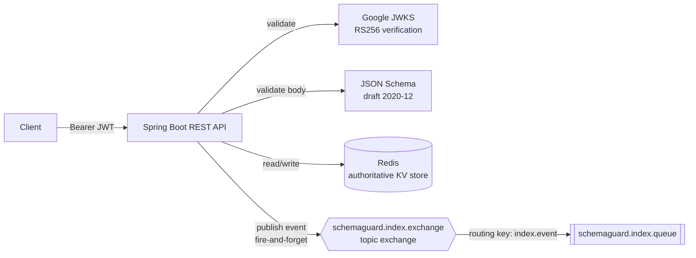

# Architecture

## Components

| Component | Role |
|-----------|------|
| Spring Boot REST API | Validates requests, enforces ETag preconditions, is the only writer to Redis |
| Redis | Authoritative key-value store for plan documents (`plan:<objectId>` → JSON + ETag + timestamp) |
| RabbitMQ | Carries `IndexEvent` messages from the API to the async indexer, decoupling the write path from Elasticsearch |
| `RabbitMQIndexListener` | Single `@RabbitListener` consumer; re-fetches the document from Redis and indexes it into Elasticsearch |
| Elasticsearch | Searchable, eventually-consistent index (`plans-index`) with a parent-child join mapping |
| Google OAuth2 / JWT | Validates Bearer tokens on protected endpoints |

## Request flow (synchronous)



The API never talks to Elasticsearch directly. A write (`POST`/`PUT`/`PATCH`/`DELETE`) only touches Redis and, on success, publishes one `IndexEvent` to RabbitMQ. The HTTP response is returned as soon as the Redis write and the (best-effort) publish complete — the caller does not wait for indexing.

## Event flow (asynchronous)

```mermaid
flowchart LR
    Queue[[schemaguard.index.queue]] -->|@RabbitListener| Listener[RabbitMQIndexListener]
    Listener -->|re-fetch by id| Redis[(Redis)]
    Listener -->|compare etag| Guard{event.etag ==<br/>current Redis etag?}
    Guard -->|no, stale| Skip[Skip — ack, no index write]
    Guard -->|yes, fresh| Index[Index into Elasticsearch]
    Index --> ES[(Elasticsearch<br/>plans-index)]
```

The listener does not trust the event payload's document content — it only uses the event to know *which* document changed, then re-reads the current state from Redis before indexing. See [consistency-model.md](consistency-model.md) for why.

`DELETE` events use a different guard than the diagram above: there's no "current etag" left in Redis to compare against once the document is gone, so the listener instead checks whether Redis has *any* document for that id. A document present means the id was recreated after this delete was published, so the delete is stale and is skipped rather than erasing the newer document's index entries.

## Parent-child indexing

`PlanDocumentSplitter` extracts each entry of the plan's `linkedPlanServices` array as a child document; everything else (including `planCostShares`) stays embedded in the parent document and is searchable only through Elasticsearch's dynamic field mapping.

| Document | `my_join_field` value | Routing |
|----------|------------------------|---------|
| Parent (`plan`) | `"plan"` (plain string) | its own `objectId` (ES default) |
| Child (`linkedPlanServices[i]`) | `{"name":"child","parent":"<parentId>"}` | `<parentId>` (set explicitly) |

Routing must match between parent and child so both are stored on the same shard — required for `has_child`/`has_parent`/`parent_id` queries to work without scattering to every shard.

## Synchronous vs. asynchronous, at a glance

| Operation | Synchronous (blocks the HTTP response) | Asynchronous (happens after the response) |
|-----------|------------------------------------------|--------------------------------------------|
| Schema validation | ✅ | |
| ETag precondition check | ✅ | |
| Redis read/write | ✅ | |
| RabbitMQ publish | ✅ (fire-and-forget call, but does not wait for the consumer) | |
| Elasticsearch indexing/deletion | | ✅ |

See [consistency-model.md](consistency-model.md) for the stale-event guard and [failure-handling.md](failure-handling.md) for what happens when Redis, RabbitMQ, or Elasticsearch are unavailable.
